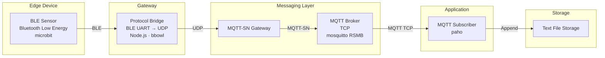

# MicroBit-MQTT-Transfer
This project contains code that uses an MQTT (Message Queue Telemetry Transport) framework to send messages from microbits

Some code from external projects has been utilized in order to facilitate this pipeline. The code is provided here along with appropriate licenses. Links to the other projects/products used are included here.

Links: 

https://microbit.org/

https://github.com/echox/bbowl

https://github.com/eclipse-mosquitto/mosquitto.rsmb

https://www.raspberrypi.com/

https://mqtt.org/

https://pypi.org/project/paho-mqtt/

This code functions as a template for creating a sensor network with microbits (or any other BLE (Bluetooth Low Energy) sensor. I used microbits for this example.
The network functions as follows:

In my case, I ran the bbowl js app and a paho publisher on a raspberry pi. The raspberry pi was responsible for handling the ble uart to udp conversion and subsequent mqtt-sn transmission. Mosquitto RSMB received the udp on another raspberry pi and converted it to TCP for regular MQTT transmission. Another PC running a paho subscriber received the MQTT messages and wrote them to a textfile on receipt. The code provided here should be enough to reproduce the project.

