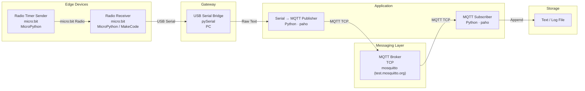

# MicroBit-MQTT-Transfer
This project contains code that uses an MQTT (Message Queue Telemetry Transport) framework to send messages from microbits

Links: 

https://microbit.org/

https://www.raspberrypi.com/

https://mqtt.org/

https://pypi.org/project/paho-mqtt/

This code functions as a template for creating a sensor network with microbits. This can theoretically be modified to allow any other radio-based messages to be transmitted and recorded.
The network functions as follows:

